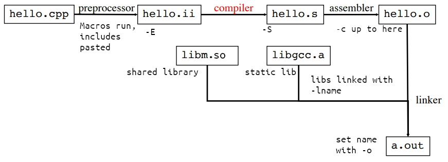

# C/C++ 编译

## 编译流程

1. 预处理
   1. 展开宏
   2. 处理条件编译指令
   3. 处理#include，复制插入
   4. 删除所有注释
   5. 添加行号和文件名标识
   6. 生成预处理后代码 .ii
2. 编译
   1. 生成汇编代码 .s
3. 汇编
   1. 将汇编翻译为机器指令，生成二进制可重定位目标程序 .o
4. 链接
   1. 关联其他 .o .a .so 库，解决符号（变量，函数）定义
   2. 生成可执行文件 .out

## Makefile

https://makefiletutorial.com/

## CMake

https://cmake.org/cmake/help/latest/guide/tutorial/index.html
