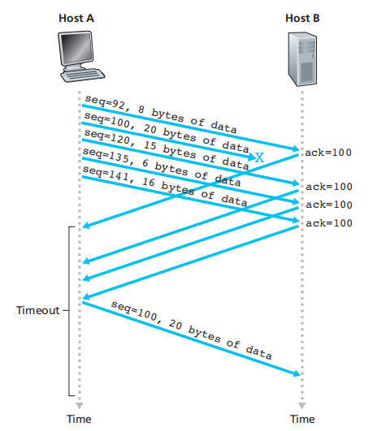
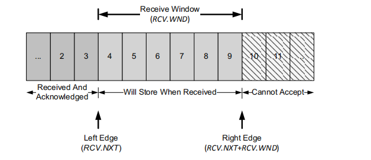
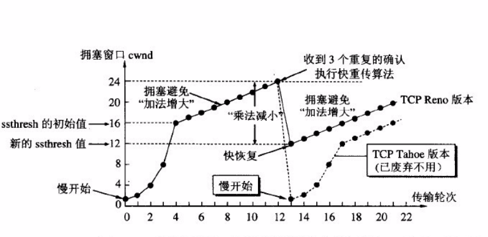

# 传输层

## UDP

### UDP头部

## TCP

### TCP状态转换

### TCP头部

### TCP三次握手

1. ISN(Initial Sequence Number)需要随机选取
2. 三次握手为了保护服务端，
   如果仅两次连接，可能出现client发送完syn后由于网络问题很久后收到server的ack和syn，此时client认为报文失效，而server认为已经完成握手，造成server空等待

### TCP四次挥手

1. 四次挥手，因为被动关闭方将，对主动关闭的确认和关闭连接操作两次进行
2. 主动关闭方在返回被动关闭方FIN的ACK后，有一个2MSL(Max Segment Lifetime)的time wait
   1. 为了给被动方的FIN返回ACK，防止第一次返回的ACK丢失（此时server重传FIN）
   2. 可能存在已失效的连接请求报文段，防止这种报文段出现在本次连接之外（如新连接和旧连接端口相同，这时收到旧连接的packet会认为合法），防止串话

### TCP可靠性

#### time based 重传

1. 每个TCP连接RTO(Retransmission Timeout)根据对应RTT(Round Trip Time)设置
2. 每个TCP设置计时器，超出TRO后重传
3. Classic Method
   1. $SRTT\leftarrow \alpha (SRTT)+(1-\alpha) RTT_{s}\qquad \alpha\in[0.8,0.9]$
   2. $RTO=\min(ubound,\max(lbound,(SRTT)\beta))\qquad \beta\in[1.3,2.0],ubound=1min,lbound=1s$
4. Standard Method
   1. 考虑网络波动
   2. $srtt\leftarrow (1-g)(srtt)+(g)M\qquad M=\text{mean deviation}$
   3. $rttvar\leftarrow (1-h)(rttvar)+(h)(|M-srtt|)$
   4. $RTO=srtt+4(rttvar)$

#### 快重传

1. TCP reveiver在收到乱序的segment时会立即生成ACK
2. TCP sender在收到重复ACK时，需确定是丢包还是延迟，当重复ACK超过duplicate ACK threshold时判断丢包，进行重传
3. 快重传不需等待RTO

### TCP流量控制

#### 延迟ACK

1. 在收到packet要发送ACK时，延时等待一会，将ACK放入可能出现的要send to对端的packet中

#### Nagle算法

1. 当TCP发出的packet未收到ACK时，禁止发送small segment($< SMSS(Sender Maximum Segment Size)$)
2. 相当于一个self-clocking，ACK返回的越快，可以越快send data
3. nagle相当于一个trade-off，使用少量大packet（增加载荷），但相对增大了delay

#### 滑动窗口

1. TCP header的windows size filed 标识empty receive buffer space(Bytes)
2. 最大$SEQ=ACK+\text{Window Size}$
3. sender会定时发送window probes去询问reveiver是否有空余，强制recevier返回ACK和Winodw Size
4. SWS(Silly Window Syndrome) 发生时，只有小的数据报被传输而非full-size，避免方法如下
   1. receiver不advertise small window
   2. sender根据nagle算法，不发送small segment

### TCP拥塞控制

#### 慢启动

1. 当TCP建立或丢包产生时，进行慢启动
2. 慢启动即在SYN交换后，cwnd(Congestion Winodow)=IW(Initial Winodw)，通常=SMSS
   随后如果没有loss packet，$W=2\times W_{pre}$
3. delay ACK会降低增加速度，所以通常在slow start后才使用
4. 一般TCP发送速率为$W/RTT$，当W过大时，cwnd会减少到之前的一半，这个转换点为ssthresh(slow start threshold)

#### 拥塞避免（加法增大）

1. 当经过ssthresh后，$cwnd_{t+1}=cwnd_{t}+SMSS*SMSS/cwnd_{t}$，cwnd每次只+about 1

#### 乘法减小

1. 当收到重复ACK进行快重传后，设置$ssthresh=\max(\text{flight size}/2,2*SMSS)$

#### 快恢复

1. 快恢复在TCP reno版本引入，旧版theno无
2. 进行乘法减小后，并不从$cwnd=1MSS$开始慢启动，而是从新的ssthresh，开始加法增大

### TCP粘包

1. TCP是流协议，可能存在接收端一次读取两段或多段数据，无法区分
2. 原因
   1. Nagle算法，TCP并不立刻发送此段数据，而是等待一小段时间，看看在等待期间是否还有要发送的数据，若有则会一次把多段数据发送出去
   2. 接收端接收不及时造成的接收端粘包。TCP会把接收到的数据 存在自己的缓冲区中，然后通知应用层取数据。当应用层由于某些原因 不能及时取出TCP的数据，就会造成TCP缓冲区中存放了多段数据
3. 解决
   1. 封包，给一段数据加上包头--一个固定大小的结构体，有一个成员变量表示包体长度
