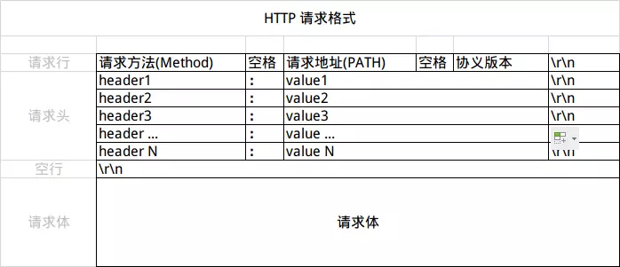

# 应用层

## DNS

### 域名层级结构

主机名.次级域名.顶级域名.根域名

### DNS记录类型

1. A：地址记录（Address），返回域名指向的IP地址
2. NS：域名服务器记录（Name Server），返回保存下一级域名信息的服务器地址该记录只能设置为域名，不能设置为IP地址
3. MX：邮件记录（Mail eXchange），返回接收电子邮件的服务器地址
4. CNAME：规范名称记录（Canonical Name），返回另一个域名，即当前查询的域名是另一个域名的跳转
5. PTR：逆向查询记录（Pointer Record），只用于从IP地址查询域名

### TTL

TTL 设置了DNS cache过期时间，较短的 TTL 是的记录能够快速刷新

### DNS解析过程


1. 查询local DNS server，本地DNS服务器一般都是你的网络接入服务器商提供，比如中国电信，中国移动
2. 查询www.163.com的DNS请求到达本地DNS服务器之后
   1. 本地DNS服务器会首先查询它的缓存记录，如果缓存中有此条记录，就可以直接返回结果
   2. 没有缓存时，本地DNS服务器还要向DNS根服务器进行查询
3. 根DNS服务器没有记录具体的域名和IP地址的对应关系，而是告诉本地DNS服务器，你可以到域服务器上去继续查询，并给出域服务器的地址
4. 本地DNS服务器继续向域服务器发出请求，在这个例子中，请求的对象是.com域服务器.com域服务器收到请求之后，也不会直接返回域名和IP地址的对应关系，而是告诉本地DNS服务器，你的域名的解析服务器的地址
5. 最后，本地DNS服务器向域名的解析服务器发出请求，这时就能收到一个域名和IP地址对应关系，本地DNS服务器不仅要把IP地址返回给用户电脑，还要把这个对应关系保存在缓存中，以备下次别的用户查询时，可以直接返回结果，加快网络访问

## Http

### http1.0

#### URL

scheme://host[:port#]/path/…/[?query-string][#anchor]

|              |                                                                                    |
| :----------- | :--------------------------------------------------------------------------------- |
| 名称         | 功能                                                                               |
| scheme       | 访问服务器以获取资源时要使用哪种协议，比如，http，https 和 FTP 等                  |
| host         | HTTP 服务器的 IP 地址或域名                                                        |
| port#        | HTTP 服务器的默认端口是 80，这种情况下端口号可以省略，如果使用了别的端口，必须指明 |
| path         | 访问资源的路径                                                                     |
| query-string | 发给 http 服务器的数据                                                             |
| anchor       | 锚                                                                                 |

#### 请求

HTTP 的请求报文分为三个部分：请求行、请求头、请求体

```http
GET /books/?sex=man&name=Professional HTTP/1.1
Host: www.example.com
User-Agent: Mozilla/5.0 (Windows; U; Windows NT 5.1; en-US; rv:1.7.6)
Gecko/20050225 Firefox/1.0.1
Connection: Keep-Alive
```



##### 请求行

请求行（Request line）分为三个部分：请求方法、请求地址和协议版本
|         |                                                                                                                                                                                                   |
| :------ | :------------------------------------------------------------------------------------------------------------------------------------------------------------------------------------------------ |
| 方法名  | 功能                                                                                                                                                                                              |
| GET     | 向指定的资源发出“显示”请求，使用 GET 方法应该只用在读取数据上，而不应该用于产生“副作用”的操作中                                                                                                   |
| POST    | 指定资源提交数据，请求服务器进行处理（例如提交表单或者上传文件）。数据被包含在请求文本中。这个请求可能会创建新的资源或者修改现有资源，或两者皆有。                                                |
| PUT     | 向指定资源位置上传其最新内容                                                                                                                                                                      |
| DELETE  | 请求服务器删除 Request-URI 所标识的资源                                                                                                                                                           |
| OPTIONS | 使服务器传回该资源所支持的所有HTTP请求方法。用*来代替资源名称，向 Web 服务器发送 OPTIONS 请求，可以测试服务器功能是否正常运作                                                                     |
| HEAD    | 与 GET 方法一样，都是向服务器发出指定资源的请求，只不过服务器将不传回资源的本文部分，它的好处在于，使用这个方法可以在不必传输全部内容的情况下，就可以获取其中关于该资源的信息（原信息或称元数据） |
| TRACE   | 显示服务器收到的请求，主要用于测试或诊断                                                                                                                                                          |
| CONNECT | HTTP/1.1 中预留给能够将连接改为通道方式的代理服务器。通常用于 SSL 加密服务器的链接（经由非加密的 HTTP 代理服务器）                                                                                |

##### 请求头

请求头用 **键: 值** 表示，注意冒号后面有一个空格

##### 请求体

#### 响应

##### 状态码

|        |                                                                |
| :----- | :------------------------------------------------------------- |
| 状态码 | 对应的信息                                                     |
| 1xx    | 提示信息—表示请求已接收，继续处理                              |
| 2xx    | 用于表示请求已被成功接收、理解、接收                           |
| 3xx    | 用于表示资源（网页等）被永久转移到其它 URL，也就是所谓的重定向 |
| 4xx    | 客户端错误—请求有语法错误或者请求无法实现                      |
| 5xx    | 服务器端错误—服务器未能实现合法的请求                          |

##### 响应头

##### 响应体

### http1.1

1. + 默认持久连接
2. + 管线化
3. + 断点续传
4. + host字段

### http2.0

1. + 使用二进制，而非明文文本格式传输
2. + 多路复用
3. + 报头压缩
4. + 服务可主动推送到客户端缓存中

### https

1. https = http +SSL

