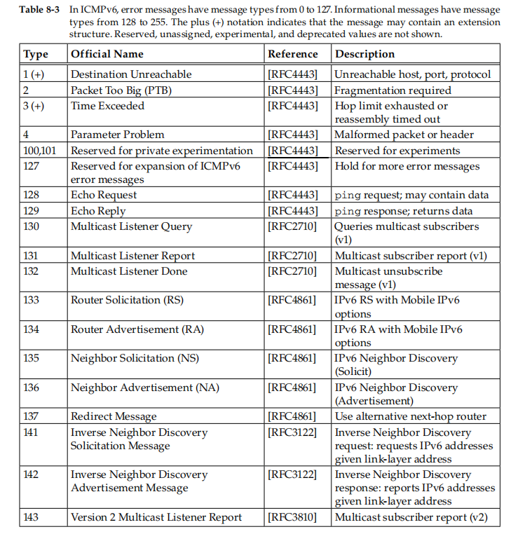

# 网络层

## IP

### IP地址

IP classes

subnet

VLSM

1. VLSM(Variable-Length Subnet Masks)使得对每个子网可以划分不同数量的hosts

### IP头部

## ICMP

ICMP(Internet Control Message Protocol)被用来提供ip诊断和控制信息

### ICMP头部

### ICMP信息

ICMPv4v4

ICMPv6

