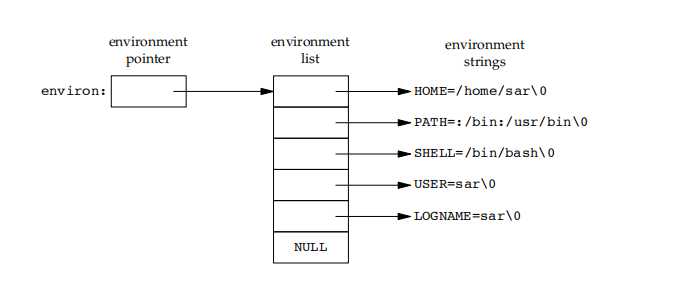
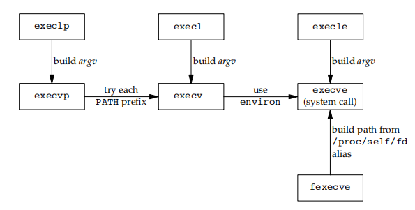

# Unix进程

## 进程环境

```cpp

```

1. 命令行参数`int argc, char **argv`
    1. `argv[0]` == 程序名
    2. `argv[argc] == nullptr`
2. 环境表  
   
   1. 每个进程有一个环境表，全局变量`extern char **environ`
   2. 环境表是哟个字符串指针数组，每个指针包含一个以null结束的c字符串地址
   3. 每一项就是环境变量
3. C程序存储空间  
    
4. 进程资源限制

## 进程控制

```cpp
pid_t getpid(void);
pid_t getppid(void);
uid_t getuid(void);
uid_t geteuid(void);
gid_t getgid(void);
gid_t getegid(void);

pid_t fork(void);
pid_t vfork(void);
int clone(int (*fn)(void *), void *stack, int flags, void *arg, ...
          /* pid_t *parent_tid, void *tls, pid_t *child_tid */);

pid_t wait(int *wstatus);
pid_t waitpid(pid_t pid, int *wstatus, int options);
int waitid(idtype_t idtype, id_t id, siginfo_t *infop, int options);

int execl(const char *pathname, const char *arg, ...
          /* (char  *) NULL */);
int execlp(const char *file, const char *arg, ...
           /* (char  *) NULL */);
int execle(const char *pathname, const char *arg, ...
           /*, (char *) NULL, char *const envp[] */);
int execv(const char *pathname, char *const argv[]);
int execvp(const char *file, char *const argv[]);
int execvpe(const char *file, char *const argv[], char *const envp[]);

```

1. 每个进程由唯一PID标识，采用延迟复用
2. pid==0 swapper调度进程，pid==1 init
3. fork
   1. fork一次返回两次，父进程返回子进程pid，子进程返回0
   2. 子进程拷贝数据空间，堆，栈，只共享程序正文段
   3. 由于在fork之后经常跟随着exec，所以现在的很多实现并不执行一个父进程数据段、栈和堆的完全副本。作为替代，使用了**写时复制（Copy-On-Write，COW）**技术。这些区域由父进程和子进程共享，而且内核将它们的访问权限改变为只读。如果父进程和子进程中的任一个试图修改这些区域，则内核只为修改区域的那块内存制作一个副本，通常是虚拟存储系统中的一“页”
   4. 文件共享，父进程打开的文件描述符被复制到子进程中，**父子进程共享同一个文件偏移量**  
   
4. vfork
      1. 目的是为了在子进程exec别的程序，保证子进程先运行，父进程在子进程exit后才运行
      2. vfork的子进程共享父进程的地址空间
5. clone
   1. 将父进程资源有选择的复制到子进程
   2. 用来实现线程（linux线程使用进程模拟的）
6. 进程结束  
   
   1. 从main返回；
   2. 调用exit（对比_exit会先执行一些清理动作）
   3. 调用_exit或_Exit；
   4. 最后一个线程从其启动例程返回
   5. 从最后一个线程调用pthread_exit
   6. 调用abort
   7. 接到一个信号
   8. 最后一个线程对取消请求做出响应
   9. 5正常+3异常
   10. 程序终止时，内核向父进程发送SIGCHLD信号，父进程可选择忽略或处理信号
   11. exec执行另一个程序，用exec并不创建新进程，所以前后的进程ID并未改变。exec只是用磁盘上的一个新程序替换了当前进程的正文段、数据段、堆段和栈段  
   
   12. 进程权限应遵循least privilege

## 进程关系

```cpp
pid_t wait(int *wstatus);
pid_t waitpid(pid_t pid, int *wstatus, int options);
```

1. 孤儿进程
   1. 其父进程已终止的进程为孤儿进程
   2. 对父进程已经终止的所有进程，其父进程变为init进程
2. 僵尸进程
   1. 一个已经终止、但是其父进程尚未对其进行善后处理（获取终止子进程的有关信息、释放它仍占用的资源）的进程被称为僵死进程（zombie）
   2. 僵尸进程会占用pid等资源
   3. 使用两次fork避免僵尸进程，first child再fork second child，second child真正执行，first child直接退出，使得second child的父进程变为init，自动回收（init会自动wait）
   4. 通过kill僵尸进程的父进程来解决僵尸进程
