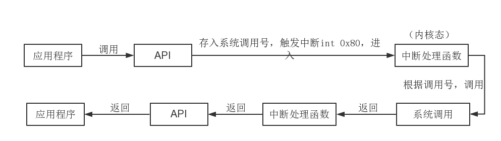
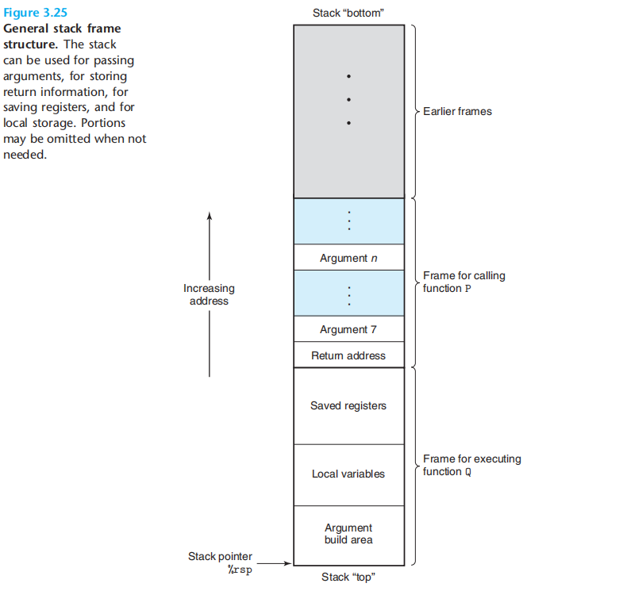
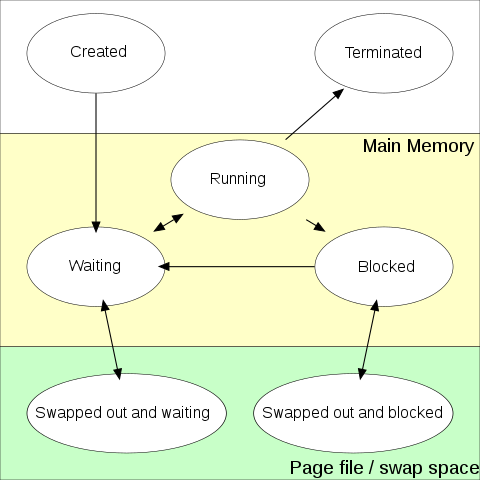

# OS

## 数的表示方法

1. 正数，源码
2. 负数，补码=正数的反码+1（7=0000 0111 -7=1111 1001）
3. 正0和负0都是0，所以少一个

## linux开机顺序

1. 加电
2. 加载BIOS
3. 加载磁盘中MBR（主引导分区）的grub（GRand Unified Bootloader）引导
4. 加载linux内核到内存；运行/sbin/init进程
5. 加载配置文件/etc/inittab
6. 根据/etc/modules.conf /etc/modules.d/加载内核模块
7. 根据运行级别运行rc0.d-rc6.d中相应的脚本程序，完成对应初始化工作和启动对应服务
8. 启动init.d/下的系统进程
9. 出现登录画面

## 敲击键盘时linux处理过程

1. 键盘控制器产生数据；并缓冲中键盘控制器寄存器中
2. 键盘控制器发送中断请求
3. 操作系统保存被中断进程的上下文；调用键盘的中断处理程序（由键盘的驱动程序初始化时注册）
4. 将键盘控制器缓存的数据转化为ASCII加入读缓冲队列
5. 显示设备驱动定时读取上述读缓冲队列加入自己的写缓冲队列；显示自己写缓冲队列中的数据
6. 恢复被中断的进程

## 用户态和内核态

1. 用户态和内核态
2. 32bit
   1. 用户态空间占0G-3G部分，内核态占3G-4G部分（高地址）
   2. 用户态和内核态的主要区别是权限不同，分别为（Ring3最低 Ring0最高）
   3. 用户态到内核态的切换方式
      1. 系统调用
      2. 异常
      3. 外围设备中断
   4. 具体切换流程
      1. 内核创建进程task_struct时，会为进程创建两个栈，用户栈和内核栈
      2. 在用户空间运行时cpu栈指针指向用户栈
      3. 切换时先将用户态堆栈指针ss和esp压入内核堆栈
3. 64bit
   1. 总空间大小一般48bit

## 系统调用过程

1. 
2. 
3. 首先，应用程序能直接调用的是系统提供的API，这个在用户态（Ring3）下就可做到
4. 然后相应的API就会将相应的系统调用号保存到eax寄存器中（这一步通过内联汇编实现），之后就是使用int 0x80触发中断（内联汇编），进入到中断处理函数中（该函数是完全由汇编代码编写），这个时候就进入到了内核态（Ring0）了
5. 在中断处理函数中就会调用与系统调用号相对应的那个系统调用。在这个函数中，会把ds、es这两个寄存器设置为指向内核空间。这样一来，我们无法把数据从用户态中传到内核态啊（如open(const char * filename, int flag, ...)中，filename指针指向的字符串的地址是在用户空间中的，在内核空间相应的地方取的话根本没有该字符串），这该怎么办呢？中断处理函数中的fs寄存器被设置为指向了用户空间，所以问题得以解决。
6. 在系统调用中就是进行相应的操作了，如打开文件、写文件等
7. 处理完后，将会返回到中断处理函数，返回值保存在eax寄存器中
8. 从中断处理函数中返回到API，依旧是把返回值保存到eax寄存器中。这个时候就从内核态恢复成用户态。
9. 在API中从eax中取出值，做相应的判断返回不同的值，用以表示操作完成情况

## 内存到cache

1. 直接相连
   1. 一个内存地址能被映射到的cache line是固定的
   2. 可能导致频繁的换入换出
2. 全相联
   1. 一个内存地址可以被映射到任意cache line
   2. 遍历查找空位费时
3. 组相联
   1. 内存和cache都分组
   2. 内存组和cache组映射固定，但在cache具体哪个块随机
   3. n路组相联指cache一个组中有n块

## cache伪共享和padding

1. 
2. “缓存一致性协议”，当一个CPU高速缓存行发生改变，为了不影响其他CPU的相关数据的正确性，必须通过某些手段让其他拥有该缓存行数据的CPU高速缓存进行数据一致性同步，这就是造成“伪共享”的所在
3. 在上图中，展示了伪共享的种表现形式，数据X、Y、Z被加载到同一Cache Line中，线程A在Core1修改X，线程B在Core2上修改Y。根据MESI缓存一致性协议，假设是Core1是第一个发起写操作的CPU核，Core1上的L1 Cache Line由S（共享）状态变成M（修改，脏数据）状态，然后告知其他的CPU核，图例则是Core2，引用同一地址的Cache Line已经无效了；当Core2发起写操作时，首先导致Core1将X写回主存，而后才是Core2从主存重新读取该地址内容以便后面的修改
4. 既然知道了伪共享产生的原因是不同的数据变量由于在物理地址的连续性导致被一起加载到同一个缓存行，所以解决的办法就是：通过数据填充的方式将不同的变量在物理地址上隔离开来，失去了地址连续性被加载到同一个缓存行的概率将大大减小
5. 缓存行大小取决于cpu，通常为64字节

## cache和寄存器区别

1. cache保存最近使用的数据，而寄存器时当前使用的数据

## 堆栈

1. 程序运行时内存布局
2. 栈帧结构
3. 堆和栈的区别
   1. 生长方式
   2. 管理方式
   3. 空间大小
   4. 碎片问题，栈没有碎片，因为总是先进后出
   5. 分配效率

## 虚拟内存优点

1. 虚拟内存为每个进程提供了统一的地址空间
2. 使各个程序独立安全，不同进程中的va对应不同pa，不同进程不可能访问到其他进程的pa
3. 因为进程仅被分配虚拟内存页面，这些页面的数据可以映射到物理页面，也可以临时保存到磁盘上（swap）而不占用物理页面；根据需要pageout或pagein
4. 虚拟内存的实际大小取决于程序开辟的空间

## 分页与分段

1. 
2. 分页
   1. 将程序的逻辑地址空间划分为固定大小的页(page)，而物理内存划分为同样大小的页框(page frame)
   2. 程序加载时，可将任意一页放人内存中任意一个页框，这些页框不必连续，从而实现了离散分配
3. 分段
   1. 虚拟内存空间根据用途被分为 代码段 数据段 堆 栈
   2. 访问权限不同

## malloc如何分配内存

1. 若分配内存小于128K，调用sbrk()，将堆顶指针向高地址移动，获得新的虚拟空间
2. 若分配内存大于128K，调用mmap()，在文件映射区域中分配匿名虚拟空间

## 进程栈和线程栈

1. 进程栈大小是执行时确定的，与编译链接无关
2. 线程栈是固定大小的，可以使用ulimit -a 查看，使用ulimit -s 修改
3. 一般默认情况下，线程栈是在进程的堆中分配栈空间，每个线程拥有独立的栈空间（一般8MB），为了避免线程之间的栈空间踩踏，线程栈之间还会有以小块guardsize用来隔离保护各自的栈空间（一般4k），一旦另一个线程踏入到这个隔离区，就会引发段错误

## 页命中与缺页

1. page hit & page fault 
2. page hit & page fault 
3. 页表存储在内存中
4. MMU中存在TLB（translation lookaside buffer）用来缓存PTE，加速查找

## 地址转换

1. address translation 

## 多级页表

1. 多级页表结构 
2. 多级页表减少了页表在内存中的大小

## 页置换算法

1. FIFO 淘汰最早进入内存的页面
2. LRU 淘汰最近没有使用的页面
3. LFU 淘汰最不常访问（计数最小）的页面
4. OPT 淘汰以后不会使用的页面

## mmap

1. `void *mmap(void *addr, size_t len, int prot, int flag, int fd, off_t off );` 
2. 实现
   1. 在当前进程的虚拟空间中，寻找一段空闲的满足要求的连续虚拟地址
   2. 为次虚拟分区分配一个vm_area_struct结构
   3. 将vm_area_struct插入进程的虚拟地址分区链表中
3. 优点
   1. 普通read() write()会先将数据保存在内核buffer中，导致两次数据拷贝；mmap()直接拷贝到用户空间
   2. mmap()使得用户空间和内核空间可以交互
   3. mmap()同时也是进程间通信的方式
4. 落盘时机
   1. 一定时间延迟后
   2. 调用msync()或munmap()
   3. 内存不足
   4. 进程退出

## 进程状态

1. 进程状态 

## 进程调度

1. FCFS 先来先服务
2. SJF 短作业优先
   1. 长作业可能饥饿
3. 基于优先权
   1. 非抢占式
   2. 抢占式
   3. 低优先级可能饥饿
4. 响应比优先
   1. $R_p=\frac{等待时间+要求服务时间}{要求服务时间}$
5. 时间片轮转
6. 多级反馈队列
   1. 按优先级划分多个就绪队列，每个队列的时间片大小随优先级增大而减小
   2. 仅当i-1队列为空时，队列i的任务被执行
   3. 新线程进入时加入优先级最高的队列，执行完时间片后移入下一个队列
   4. 在若干cpu时间后将低优先级队列的进程放入高优先级队列防止饥饿
7. CFS 完全公平算法
   1. $分配给进程的运行时间=\frac{调度周期*进程权重}{所有进程权重和}$ 其中调度周期是遍历所有task_running状态的进程的时间和
   2. $vruntime=\frac{实际运行时间*1024}{进程权重}$
   3. 根据vruntime的大小决定运行顺序（小的优先），红黑树记录vruntime-min_vruntime防止值溢出
   4. 权重通过nice值转换，nice越大权重越低
   5. 新进程的vruntime的红黑树中记录的min_vruntime，防止旧进程饥饿
   6. 休眠进程被唤醒时，vruntime以min_vruntime为基础，并进行少量补偿
   7. 进程在cpu间切换时，首先减去当前cpu的min_vruntime转移后加上目标cpu的min_vruntime

## 孤儿进程与僵尸进程

1. 孤儿进程
   1. 父进程退出的进程
   2. 孤儿进程会被init进程收养
2. 僵尸进程
   1. 子进程退出但父进程未调用wait()或waitpid()，那么子进程仍然保留在系统中，成为僵尸进程defunct
   2. 僵尸进程会占用占用资源
   3. 解决
      1. 父进程代码中调用wait()或waitpid()
      2. 子进程退出时向父进程发送SIGCHILD信号，父进程处理SIGCHILD信号。在信号处理函数中调用wait进行处理僵尸进程
      3. fork()两次，子进程创建孙子进程，子进程直接退出，孙子进程执行操作，此时孙子进程成为孤儿交由init管理
      4. kill，kill不掉时kill僵尸进程的父进程
      5. 重启

## 打开文件表

1. 每个进程都有一个打开文件表

## fork vfork clone

1. fork() 的子进程是父进程的完全副本
   1. 相同
      1. 环境变量
      2. 资源限制
      3. 内存分布
      4. 信号掩码
   2. 不同
   3. fork使用cow写时复制技术，开始时子进程共享父进程空间（页帧），仅当子进程或父进程修改数据时复制
2. vfork()
   1. vfork保证子进程先运行，父进程被挂起，适用于子进程立即调用exec()的情形
   2. vfork直接共享父进程空间
   3. vfork的子进程退出时应使用exit() 而非return
3. clone()
   1. clone函数有更多的参数控制如何复制进程，linux的pthread使用clone创建

## fork和printf

```cpp
for (int i = 0; i < 2; i++) {
    fork();
    printf("A\n");  // 6 A，\n 才会清空缓冲
    printf("A");  // 8 A ，因为printf的缓冲在被继承，child2 和 granchild1
                  // 都会多打印一个
  }
```

## 信号

1. 常见信号 
2. 常见信号产生
   1. ctrl+c SIGINT
   2. 子进程结束 SIGCHILD
   3. terminal关闭 SIGHUP

## linux进程优雅退出

1. 设置信号处理函数，在进程结束时清理资源

```cpp
#include <signal.h>
#include <stdio.h>
#include <stdlib.h>
#include <unistd.h>

void handler(int sig) {
  if (sig == SIGINT)
    printf("SIGINT\n");
  else if (sig == SIGKILL)
    printf("SIGKILL\n");
  else if (sig == SIGSEGV)
    printf("SIGSEGV\n");
  else if (sig == SIGTERM)
    printf("SIGTERM\n");
  printf("%s", "clear resource...\n");
  printf("graceful exit \n");
  exit(0);
}

int main() {
  signal(SIGINT, handler);
  int i = 0;
  while (1) {
    printf("i %d\n", i++);
    sleep(2);
  }
  return 0;
}
```

## 进程间通信方式

1. 无名管道 pipe
   1. `int pipe(int fd[2]);`
   2. fd[0]都是读端 fd[1]都是写端，只能父子间传递
2. 有名管道 fifo
   1. `int mkfifo(const char *pathname, mode_t mode);`
3. 信号 signal
4. 消息队列
   1. `int msgget(key_t key, int flag);`
   2. `int msgctl(int msqid, int cmd, struct msqid_ds *buf );`
   3. `int msgsnd(int msqid, const void *ptr, size_t nbytes, int flag);`
   4. `ssize_t msgrcv(int msqid, void *ptr, size_t nbytes, long type, int flag);`
5. 共享内存
6. 信号量 semaphore
7. 套接字 socket

## 信号和信号量的区别

1. 信号用于传递消息，信号量用于保护临界资源
2. signal，又简称为信号（软中断信号 ）用来通知进程发生了异步事件
   1. 一个进程收到一个信号与处理器收到一个中断请求可以说是一样的。信号是进程间通信机制中唯一的异步通信机制，一个进程不必通过任何操作来等待信号的到达，事实上，进程也不知道信号到底什么时候到达。进程之间可以互相通过系统调用kill发送软中断信号。内核也可以因为内部事件而给进程发送信号，通知进程发生了某个事件。信号机制除了基本通知功能外，还可以传递附加信息
3. Linux内核的信号量用来操作系统进程间同步访问共享资源
   1. 信号量在创建时需要设置一个初始值，表示同时可以有几个任务可以访问该信号量保护的共享资源，初始值为1就变成互斥锁（Mutex），即同时只能有一个任务可以访问信号量保护的共享资源

## 进程与线程与协程区别

1. linux下线程是通过进程实现的（线程是轻量级进程）
2. 同一个进程下的线程共享该进程空间，每增加一个线程内存使用仅多一个栈的大小
3. 进程线程由os调度，协程属于用户自己调度（保存寄存器）
4. 线程切换只能发生在函数间，协程的切换可以发生在任何代码之间

## 切换开销

1. 进程
   1. 切换虚拟空间地址
   2. 切换cpu上下文
      1. 寄存器中的内容
      2. cpu高速缓存失效
      3. tlb失效
   3. 切换内核栈
      1. 用户态到内核态再到用户态

## 线程同步方式

1. 互斥量
2. 条件变量
   1. suprious wakeup 问题，需要`while(!satisfy){cond.wait(lock);}`
3. 信号量

## 互斥量的实现方式

1. 操作系统testandset()
   1. 保证对互斥量的检查和赋值是原子的

## spinlock与mutex

1. spinlock需要关中断
   1. 所有spinlock都会关闭抢占
   2. 不关中断spinlock可能死锁，比如任务A进行spinlock此时中断，进程B因为优先级高运行且需要获得锁，则死锁
2. mutex不能
   1. 因为睡眠依赖于调度器，调度器依赖于时钟中断

## 死锁

1. 死锁条件
   1. 互斥条件：一个资源每次只能被一个进程使用
   2. 占有且等待：一个进程因请求资源而阻塞时，对已获得的资源保持不放
   3. 不可强行占有:进程已获得的资源，在末使用完之前，不能强行剥夺
   4. 循环等待条件:若干进程之间形成一种头尾相接的循环等待资源关系
2. 处理死锁
   1. 死锁预防：通过设置某些限制条件，去破坏死锁的四个条件中的一个或几个条件，来预防发生死锁
   2. 死锁避免：允许前三个必要条件，但通过明智的选择，确保永远不会到达死锁点
   3. 死锁检测：不须实现采取任何限制性措施，而是允许系统在运行过程发生死锁，但可通过系统设置的检测机构及时检测出死锁的发生，并精确地确定于死锁相关的进程和资源，然后采取适当的措施，从系统中将已发生的死锁清除掉
   4. 死锁解除：撤销或挂起一些进程，以便回收一些资源，再将这些资源分配给已处于阻塞状态的进程
3. 银行家算法
   1. 
   2. 假设资源P1申请资源，银行家算法先试探的分配给它（当然先要看看当前资源池中的资源数量够不够），若申请的资源数量小于等于Available，然后接着判断分配给P1后剩余的资源，能不能使进程队列的某个进程执行完毕，若没有进程可执行完毕，则系统处于不安全状态（即此时没有一个进程能够完成并释放资源，随时间推移，系统终将处于死锁状态）
   3. 
   4. 若有进程可执行完毕，则假设回收已分配给它的资源（剩余资源数量增加），把这个进程标记为可完成，并继续判断队列中的其它进程，若所有进程都可执行完毕，则系统处于安全状态，并根据可完成进程的分配顺序生成安全序列（如{P0，P3，P2，P1}表示将申请后的剩余资源Work先分配给P0–>回收（Work+已分配给P0的A0=Work）–>分配给P3–>回收（Work+A3=Work）–>分配给P2–>······满足所有进程）

## coredump文件

1. 默认名core，默认路径同可执行文件路径
2. `ulimit -c` 设置core文件大小

## Linux 命令

1. 如何将进程放置后台和前台
   1. `./server &`
   2. `bg jobid` jobid通过jobs获取
   3. `fg jobid`
2. 命令行中的信号
   1. ctrl+c SIGINT 结束进程
   2. ctrl+z SIGTSTP 将一个正在前台执行的命令放到后台，并且处于暂停状态，不可执行
3. ssh断开后后台进程
   1. 在ssh中启动的后台进程会挂
   2. `nohup ./server &` 在用户注销或者网络断开时终端会受到HUP信号而关闭所有子进程，nohub让终端忽略改消息
4. top
   1. top命令查看内存和cpu使用
   2. VIRT = SWAP + RES 是进程需要的虚拟内存大小
   3. RES = CODE + DATA 是进程实际的内存大小
   4. SHR = 是共享的内存大小 + 共享库的大小
   5. 一个进程占用的物理内存大小 = RES - SHR
5. dig 查询dns；dig+trace
6. ulimit -a 查看系统资源设置
7. lsof -p pid 查看进程打开的文件描述符
8. /proc/目录
   1. /proc/meminfo
   2. /proc/cpuinfo
   3. /proc/pid/fd
9. strace ./a.out 查看系统调用
10. kill可发送信号`kill -s signal pid(number)`