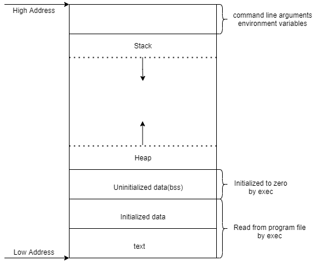

# 各类变量存储区

## C 语言内存区块



1. 栈区
   1. 局部变量，参数，返回值等
2. 堆区
   1. new/malloc 的对象
   2. 默认作为自由存储区
3. 数据区
   1. 全局或静态变量
4. 代码区
   1. 只读存储区（字符常量等）
   2. 文本区

```cpp
// main.cpp

int a = 0;  //全局初始化区
char *p1;   //全局未初始化区
void main() {
  int b;                    //栈
  char s[] = "abc";         //栈
  char *p2;                 //栈
  char *p3 = "123456";      // 123456{post.content}在常量区，p3在栈上
  static int c = 0;         //全局（静态）初始化区
  p1 = (char *)malloc(10);  //分配得来得10字节的区域在堆区
  p2 = (char *)malloc(20);  //分配得来得20字节的区域在堆区
  strcpy(p1, "123456");
  // 123456{post.content}放在常量区，编译器可能会将它与p3所指向的"123456"优化成一块
}
```
