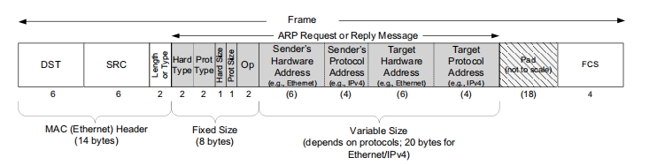

# 链路层

## ARP

1. mac地址
   1. mac地址共48bit，前24位为组织唯一标志符（Organizationally Unique Identifier，即OUI），是由IEEE的注册管理机构给不同厂家分配的代码，区分了不同的厂家
   2. 后24位是由厂家自己分配的，称为扩展标识符。同一个厂家生产的网卡中MAC地址后24位是不同的
   3. 同一局域网内相同mac会地址冲突，需要手动修改；不同局域网网关不同，不冲突
2. 有了mac也需要ip
   1. 交换机处理mac，路由器处理ip
   2. 可以解决广播占用带宽问题，即广播只在子网中
3. ARP用来发现IP地址和对应的MAC地址
4. ARP发现必须在相同子网

### ARP报文

### ARP Cache

1. 每个host和router有ARP cache table
