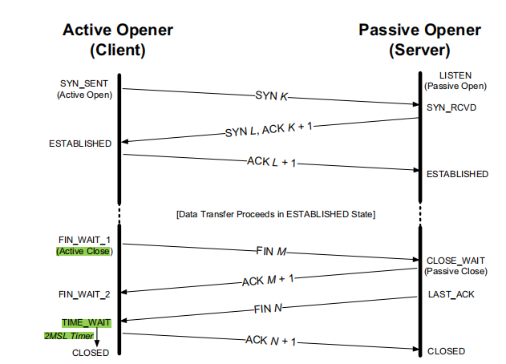
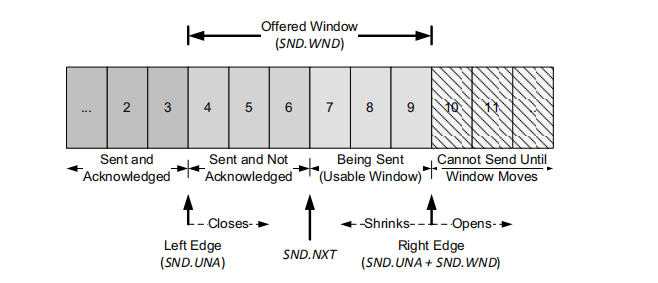
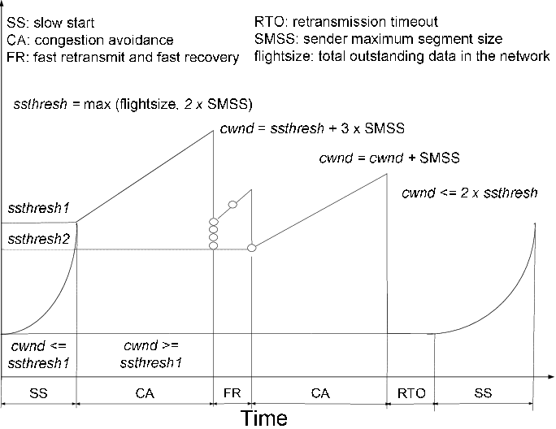

# Transport Layer

## UDP

### UDP header

## TCP

### TCP header

### TCP 3-handshake

1. ISN(Initial Sequence Number) is select randomly
2. 3 times handshake is a kind of protect for server side.
   In the case that client has sent SYN but get server's ACK and
   SYN late(timeout), client thinks the server does not response
   but server thinks handshake has completed and wait idlely.

### TCP 4-handwave

1. TCP is duplex, it allows each of direction closed undependly
2. There is a 2MSL(Max Segment Lifetime) time wait after active opener
   1. To response passive opener's FIN and ACK, which allow server to re-send FIN if lost
   2. To get rid of old message delivered to new session which has same IP and port number

### TCP Reliability

#### time based Retransimission

1. TCP RTO(Retransmission Timeout)based on RTT(Round Trip Time)
2. TCP has a timer and retransimit after exceeding RTO
3. Classic Method
   1. $SRTT\leftarrow \alpha (SRTT)+(1-\alpha) RTT_{s}\qquad \alpha\in[0.8,0.9]$
   2. $RTO=\min(ubound,\max(lbound,(SRTT)\beta))\qquad \beta\in[1.3,2.0],ubound=1min,lbound=1s$
4. Standard Method
   1. $srtt\leftarrow (1-g)(srtt)+(g)M\qquad M=\text{mean deviation}$
   2. $rttvar\leftarrow (1-h)(rttvar)+(h)(|M-srtt|)$
   3. $RTO=srtt+4(rttvar)$

#### Fast Retransimission

1. TCP reveiver sends ACK immeadately when received out of order segment
2. When TCP server reveived duplicate ACK, it judges if these ACK caused by segemnt loss or network delay according to duplicate ACK threshold
3. Fast Retransimission does not need to wait RTO

### TCP Flow Control

#### Delary ACK

1. Wait a little time to send ACK when received a packet
2. Try to put ACK to the packet which will be sent to peer side

#### Nagle Algorithm

1. Do not send small packet($< SMSS(Sender Maximum Segment Size)$) when does not receive previous ACK
2. Nagle works as sefl-clocking, the faster ACK comes back, the more data will be sent
3. Nagle works on a trade-off which use less number packet(with big overload), but increase the delay

#### Slide Window

1. TCP header's windows size filed indicate empty receive buffer space(Bytes)
2. $\max SEQ=ACK+\text{Window Size}$
3. sender send window probesto query reveiver's free space, which forces recevier response ACK and Winodw Size
4. SWS(Silly Window Syndrome) phenomenon means only small segment can be transimted
   1. receiver does not advertise small window
   2. sender does not send small segment according to Nagle

### TCP Congestion Control

#### Slow Start

1. Slow start happens when connection established or packet loss
2. Slow start happens after exchange of SYN and cwnd(Congestion Winodow) = IW(Initial Winodw) = SMSS
3. If no loss packet，$W=2\times W_{pre}$
4. Delay ACK is adopted after slow start since it decrease speed up ration
5. TCP's send speed is $W/RTT$. cwnd will be decreased to half of previus value when W is too big, this time point is ssthresh(slow start threshold)

#### Congestion Avoidance

1. After ssthresh，$cwnd_{t+1}=cwnd_{t}+SMSS*SMSS/cwnd_{t}$，cwnd+=about 1 for each time

#### Fast Recovery

1. After fast retransimission，set $ssthresh=\max(\text{flight size}/2,2*SMSS)$
2. After the decreasing, start with new ssthreash rather than $cwnd=1MSS$ with slow start

### TCP seperate each "packet"

1. TCP is stream protocol, receiver may receive half segment,
   one segment or multiple segment at each time
2. This is caused by
   1. Nagle -> It does not send small packet immeadeatly and try to send many segment together
   2. Recevier can not comsume segment from buffer quickly -> TCP buffer accumulates many segment
3. Can be solved by
   1. Construct a "packet" -> define a packet header which indicate the length of data
