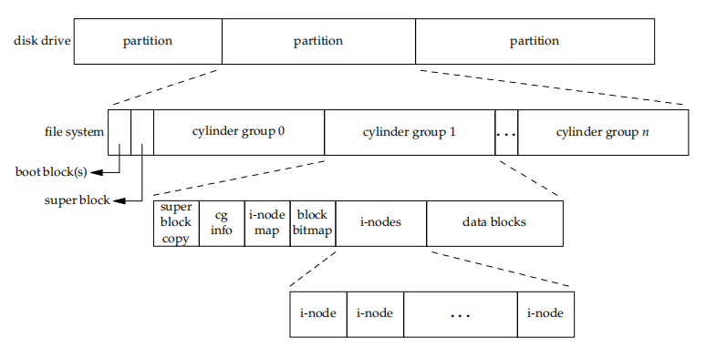
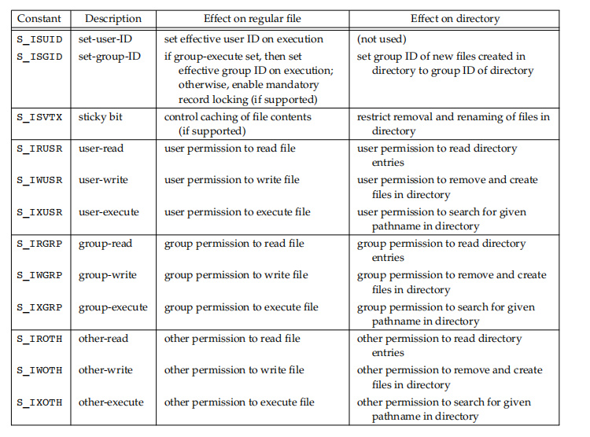

# Unix文件系统

## 磁盘与文件




```cpp
int stat(const char *pathname, struct stat *statbuf);
int fstat(int fd, struct stat *statbuf);
int lstat(const char *pathname, struct stat *statbuf);
int fstatat(int dirfd, const char *pathname, struct stat *statbuf, int flags);

int access(const char *pathname, int mode);
int faccessat(int dirfd, const char *pathname, int mode, int flags);

mode_t umask(mode_t mask);

int chmod(const char *pathname, mode_t mode);
int fchmod(int fd, mode_t mode);
int fchmodat(int dirfd, const char *pathname, mode_t mode, int flags);

int chown(const char *pathname, uid_t owner, gid_t group);
int fchown(int fd, uid_t owner, gid_t group);
int lchown(const char *pathname, uid_t owner, gid_t group);
int fchownat(int dirfd, const char *pathname, uid_t owner, gid_t group,
             int flags);

int truncate(const char *path, off_t length);
int ftruncate(int fd, off_t length);

int link(const char *oldpath, const char *newpath);
int linkat(int olddirfd, const char *oldpath, int newdirfd, const char *newpath,
           int flags);
int unlink(const char *pathname);
int unlinkat(int dirfd, const char *pathname, int flags);
int remove(const char *pathname);  // It calls unlink for files, and rmdir for
                                   // directories.
int rename(const char *oldpath, const char *newpath);
int renameat(int olddirfd, const char *oldpath, int newdirfd,
             const char *newpath);

int symlink(const char *target, const char *linkpath);
int symlinkat(const char *target, int newdirfd, const char *linkpath);

int utimes(const char *filename, const struct timeval times[2]);
int futimes(int fd, const struct timeval tv[2]);
int lutimes(const char *filename, const struct timeval tv[2]);

int mkdir(const char *pathname, mode_t mode);
int mkdirat(int dirfd, const char *pathname, mode_t mode);
DIR *opendir(const char *name);
DIR *fdopendir(int fd);
struct dirent *readdir(DIR *dirp);

int chdir(const char *path);
int fchdir(int fd);
```

1. 磁盘可分为多个区，每个区可包含一个文件系统
2. i节点，是固定长度的记录，包含文件相关信息
   1. 文件类型，访问权限，文件长度，链接计数，数据块的指针
   2. 当链接计数为0时才可释放文件占用的数据块
3. 文件类型： 普通文件，目录文件，块特殊文件，字符特殊文件，FIFO，套接字，符号链接
4. 硬链接直接指向文件的i节点，符号链接（软连接）是文件的间接指针符
5. 文件时间：atim最后访问时间，mtim最后修改时间，ctim i节点状态最后更改时间
6. 文件长度：目录文件长度通常为16或512的整倍数；普通文件可以包含空洞，由偏移超过末尾并写入造成
7. 文件访问权限
   
8. 粘着位sticky bit
   1. 如果一个可执行程序文件的这一位被设置了，那么当该程序第一次被执行，在其终止时，程序正文部分的一个副本仍被保存在交换区（程序的正文部分是机器指令）。这使得下次执行该程序时能较快地将其装载入内存。
   2. 如果对一个目录设置了粘着位，只有对该目录具有写权限的用户并且满足下列条件之一，才能删除或重命名该目录下的文件：拥有此文件；拥有此目录；是超级用户

## Linux目录结构


