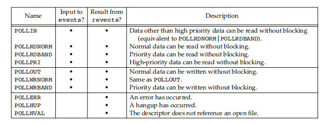

# Unix IO

## File IO

1. Each process access file by fd(>0)
2. Each file has a current file offset(>0) indicate current position(Byte) from beginning of file
3. The return value of read() can less than required. Write() is similiar
4. If multiple process open the same file, lseek() and write() may cause race condition. Use stom operation pread() or pwrite()
5. read() and wirte() executed at kernel. They do not have buffer.

## Standard IO

1. 对于标准I/O库，它们的操作是围绕流（stream）进行的，流是读写文件的抽象
2. 当用标准IO打开或创建一个文件时，已经让一个流与文件关联
3. stream's orientation流的定向决定了所读写字符是单字节（ASCII）还是宽字符（UTF等）
4. 每个进程预定义了三个流stdin、stdout和stderr，与STDIN_FILENO、STDOUT_FILENO 和STDERR_FILENO定义的文件对应
5. 标准IO提供缓冲减少read，write调用次数
   1. 全缓冲，此时填满IO缓冲区后才进行实际IO，flush将buffer内容写入磁盘
   2. 行缓冲，此时在输入输出遇到换行符时执行IO
   3. 不带缓冲
6. IO缓冲惯例
   1. 标准错误是不带缓冲的
   2. 打开至终端设备的流是行缓冲的
   3. 其他流是全缓冲的
7. 流的读写，带f的函数通常指定FILE对象，不带一般对应stdin等
   1. 每次一个字符IO
   2. 每次一行IO
   3. 直接IO
   4. 二进制IO

## 高级IO

```cpp
int select(int nfds, fd_set *readfds, fd_set *writefds, fd_set *exceptfds,
           struct timeval *timeout);
void FD_CLR(int fd, fd_set *set);
int FD_ISSET(int fd, fd_set *set);
void FD_SET(int fd, fd_set *set);
void FD_ZERO(fd_set *set);
int pselect(int nfds, fd_set *readfds, fd_set *writefds, fd_set *exceptfds,
            const struct timespec *timeout, const sigset_t *sigmask);

struct pollfd {
    int fd;        /* file descriptor */
    short events;  /* requested events */
    short revents; /* returned events */
};
int poll(struct pollfd *fds, nfds_t nfds, int timeout);
int ppoll(struct pollfd *fds, nfds_t nfds, const struct timespec *tmo_p,
          const sigset_t *sigmask);

typedef union epoll_data {
    void *ptr;
    int fd;
    uint32_t u32;
    uint64_t u64;
} epoll_data_t;

struct epoll_event {
    uint32_t events;   /* Epoll events */
    epoll_data_t data; /* User data variable */
};
int epoll_create(int size);  // Since Linux 2.6.8, the size argument is ignored
int epoll_ctl(int epfd, int op, int fd, struct epoll_event *event);
int epoll_wait(int epfd, struct epoll_event *events, int maxevents,
               int timeout);
int epoll_pwait(int epfd, struct epoll_event *events, int maxevents,
                int timeout, const sigset_t *sigmask);
```

1. 阻塞IO
   1. 
   2. 低速系统调用可能会使进程永远阻塞
   3. 如果某些文件类型（如读管道、终端设备和网络设备）的数据并不存在，读操作可能会使调用者永远阻塞
   4. 如果数据不能被相同的文件类型立即接受（如管道中无空间、网络流控制），写操作可能会使调用者永远阻塞
   5. 在某种条件发生之前打开某些文件类型可能会发生阻塞（如要打开一个终端设备，需要先等待与之连接的调制解调器应答，又如若以只写模式打开FIFO，那么在没有其他进程已用读模式打开该FIFO时也要等待
   6. 对已经加上强制性记录锁的文件进行读写
   7. 某些ioctl操作
   8. 某些进程间通信函数
   9. 虽然读写磁盘文件会暂时阻塞调用者，但并不能将与磁盘I/O有关的系统调用视为“低速”
2. 非阻塞I/O
   1. 
   2. 我们可以发出open、read和write这样的I/O操作，并使这些操作不会永远阻塞，如果这种操作不能完成，则调用立即出错返回，表示该操作如继续执行将阻塞
   3. 如果调用open获得描述符，则可指定O_NONBLOCK标志
   4. 对于已经打开的一个描述符，则可调用fcntl，由该函数打开 O_NONBLOCK 文件状态标志
3. IO复用
   1. 
   2. select
      1. 传给select的参数告知内核进程所关心的fd，对每个fd所关心的条件（可读？可写？），可等待时间
      2. select返回时告知进程，已准备好fd的数量，对于读写异常三类条件每一个，哪些fd以准备好
      3. nfds=max fd of 3 sets + 1，要检查的最大fd个数
   3. poll
      1. poll不是为每个条件（可读性、可写性和异常条件）构造一个描述符集，而是构造一个pollfd结构的数组，每个数组元素指定一个描述符编号以及我们对该描述符感兴趣的条件
      2. 
   4. epoll
      1. epoll时select和poll的增强版
      2. epoll使用一个文件描述符（使用后需要close() epoll打开的fd）管理多个描述符，将用户关系的文件描述符的事件存放到内核的一个事件表中，这样在用户空间和内核空间之间的数据拷贝只需一次
      3. 不随fd数量增大而效率下降，因为不许像select/poll线性检查所有fd，只对活跃fd检查
      4. LT(level triggered，水平触发模式)是缺省的工作方式，并且同时支持 block 和 non-block socket。在这种做法中，内核告诉你一个文件描述符是否就绪了，然后你可以对这个就绪的fd进行IO操作。如果你不作任何操作，内核还是会继续通知你的，所以，这种模式编程出错误可能性要小一点
      5. ET(edge-triggered，边缘触发模式)是高速工作方式，只支持no-block socket。在这种模式下，当描述符从未就绪变为就绪时，内核通过epoll告诉你。然后它会假设你知道文件描述符已经就绪，并且不会再为那个文件描述符发送更多的就绪通知，等到下次有新的数据进来的时候才会再次出发就绪事件
4. 异步IO
   1. 进程告诉内核：当描述符准备好可以进行I/O时，用一个信号通知它
