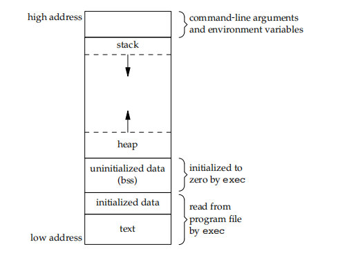
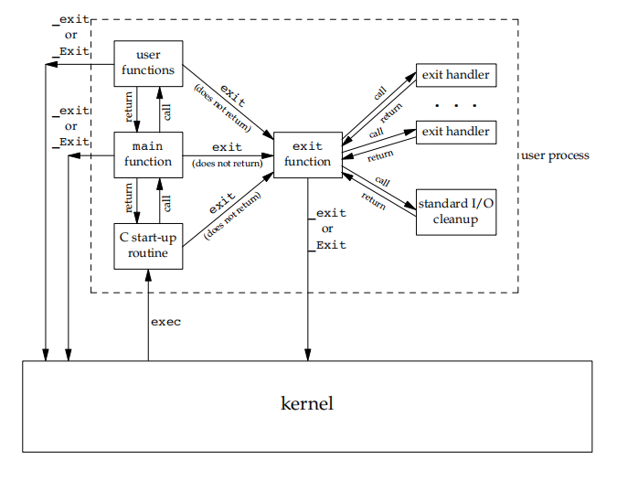

# Unix Process

## Process Environment

1. command line args `int argc, char **argv`
    1. `argv[0]` == program name
    2. `argv[argc] == nullptr`
2. environment table  
   
   1. Each process has a environment list, point by `extern char **environ`
   2. env list is a array of char*, each pointer contains a c string end with \0
3. C program  
    
4. process can only have limitted resource

## Process Control

1. Each process has unique PID (Delay Multiplexing)
2. PID==0 swapper/scheduler process, PID==1 init process
3. fork()
   1. One fork() call return twice, parent return cild pid, cild return 0
   2. Child copy parent's data, heap, stack, only share program text
   3. Copy-on-Write means child does not copy all fields until parent or child want to modify a filed
   4. Parent's file table is copyed to child, the file offset is shared
4. vfork()
   1. Aims on exec() other program in child. Promise child run firstly and parent run after child finish
   2. Child shares parent's address
5. clone()
   1. Copy parent's resource selectly
   2. To achieve thread
6. process end
   

## Process Relation

1. Orphan process
   1. whose parent is finished
   2. orphan process's parent becomes to init
2. Zombie process
   1. Who is finished but its parent does not handle the finish,i.e. dose not call wait()
   2. It still occupy pid
   3. Can use twice fork() to avoid zombie. First child -> fork() second child -> second child run program -> first child exit directly -> second child adopt by init
   4. Can kill zombie's parent to solve zombie process
